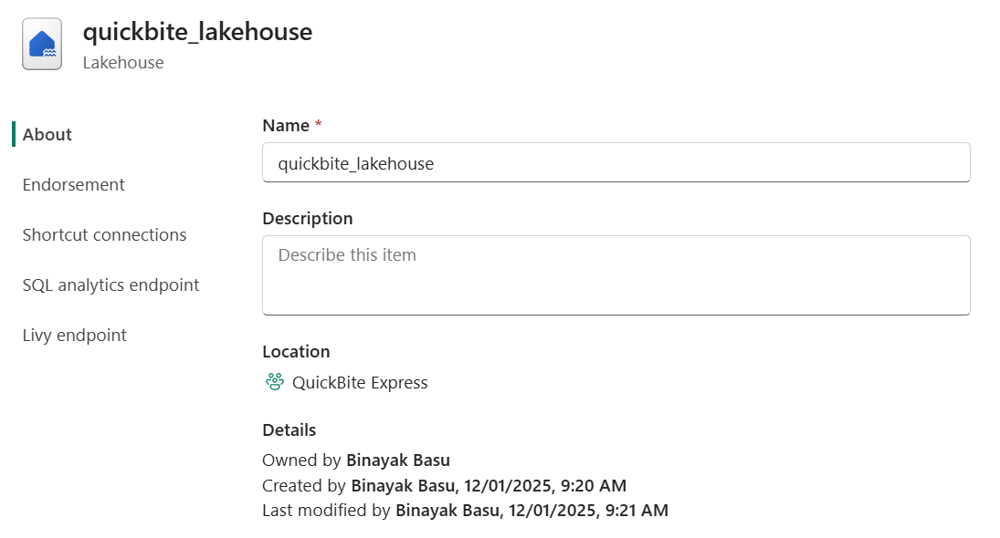
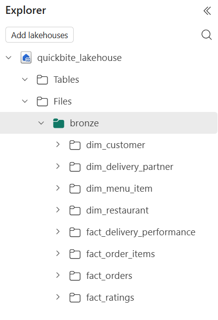
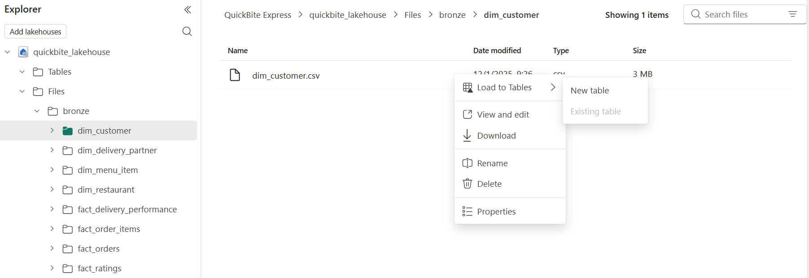
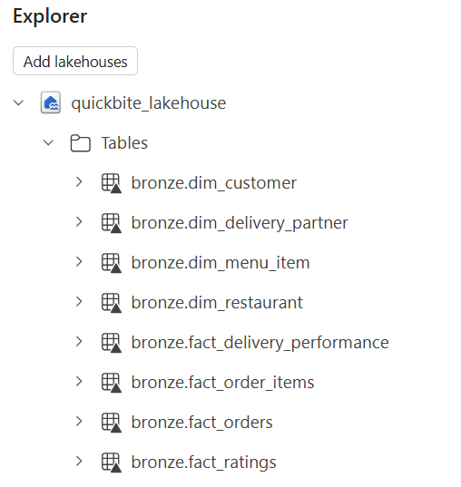

# 🥉 QuickBite Lakehouse — Bronze Layer Documentation

**Phase 1: Raw Data Ingestion**

---

## 📌 Overview

The **Bronze Layer** represents the **raw ingestion zone** of the QuickBite analytics platform.
Its purpose is to store source data **exactly as received** , without applying business logic or transformations.

In this project, the Bronze layer is implemented using **Microsoft Fabric Lakehouse (OneLake)** and serves as the foundation for all downstream Silver and Gold transformations.

---

## 🎯 Objectives

- Ingest raw CSV extracts into OneLake
- Preserve original structure and values
- Enable schema discovery and query access via Delta tables
- Maintain immutability and traceability of source data

---

## 🧰 Components Used

| Component                        | Purpose                                       |
| -------------------------------- | --------------------------------------------- |
| **Fabric Lakehouse (OneLake)**   | Central storage for raw data files            |
| **Lakehouse UI (Manual Upload)** | Upload CSV files directly into Bronze folders |
| **Delta Tables (Bronze Tables)** | Register raw files as queryable tables        |

---

## 📥 Ingestion Strategy

### Why Manual Upload?

Manual ingestion was chosen intentionally due to the **PoC nature** of this project.

**Rationale:**

- Small dataset size
- No requirement for scheduled or incremental ingestion
- Faster iteration during development
- Lower Fabric capacity usage

> ⚠️ For production-scale pipelines, this approach should be replaced with Fabric Pipelines, Data Factory, or Dataflows Gen2.

---

## 🏗️ Step 1 — Lakehouse & Bronze Folder Setup

### Lakehouse Created

- **Name:** `quickbite_lakehouse`

This Lakehouse acts as the central storage and processing layer for the project.

📸 _Screenshot:_
`/screenshots/quickbite_lakehouse.png`


---

### Bronze Folder Structure

Within the Lakehouse → **Files** section, a dedicated `/bronze` directory was created to logically separate raw data.

```text
/bronze/
├── fact_orders/
├── fact_order_items/
├── fact_ratings/
├── fact_delivery_performance/
├── dim_customer/
├── dim_restaurant/
├── dim_delivery_partner/
└── dim_menu_item/
```

📸 _Screenshot:_
`/screenshots/quickbite_lakehouse_folder_str.png`


Each folder corresponds to a **single source entity** , ensuring clarity and maintainability.

---

## 📤 Step 2 — Upload Raw CSV Files

### Actions Performed

- Used **Lakehouse UI → Upload → Browse**
- Uploaded each CSV file into its corresponding Bronze folder
- No preprocessing or modification applied

### Key Principle

> **Raw means raw**
> Data in the Bronze layer is stored **as-is** , preserving the original source format and values.

---

## 📊 Step 3 — Create Bronze Delta Tables

### Objective

Convert raw CSV files into **Bronze Delta Tables** to enable:

- Schema inference
- SQL querying
- Downstream transformations

---

### Table Creation Process

For each CSV file:

**Navigation Path**

```
Lakehouse → Files → bronze → <entity_folder>
→ Load to Tables → New Table
```

📸 _Screenshot:_
`/screenshots/quickbite_lakehouse_bronze_table_creation.png`


---

### Bronze Tables Created

```sql
bronze.fact_orders
bronze.fact_order_items
bronze.fact_ratings
bronze.fact_delivery_performance
bronze.dim_customer
bronze.dim_restaurant
bronze.dim_delivery_partner
bronze.dim_menu_item
```

### Schema Handling

- Column names auto-detected
- Basic data type coercion applied (string, integer, decimal)
- **No business transformations performed**

---

### Verification

All Bronze tables are visible under:

```
quickbite_lakehouse → Tables → bronze.*
```

📸 _Screenshot:_
`/screenshots/quickbite_lakehouse_bronze_tables_created.png`


---

## ✅ Bronze Layer Best Practices Followed

- ✔ Raw data preserved without modification
- ✔ Logical folder-to-table mapping
- ✔ Clear separation between Facts and Dimensions
- ✔ Minimal processing (schema inference only)
- ✔ Ready for Silver layer transformations

---

## 🔜 Next Phase

➡️ **Silver Layer**

- Data cleaning and standardization
- Dataflow Gen2 transformations
- Business-rule application

---

**Layer:** Bronze
**Platform:** Microsoft Fabric Lakehouse

---
