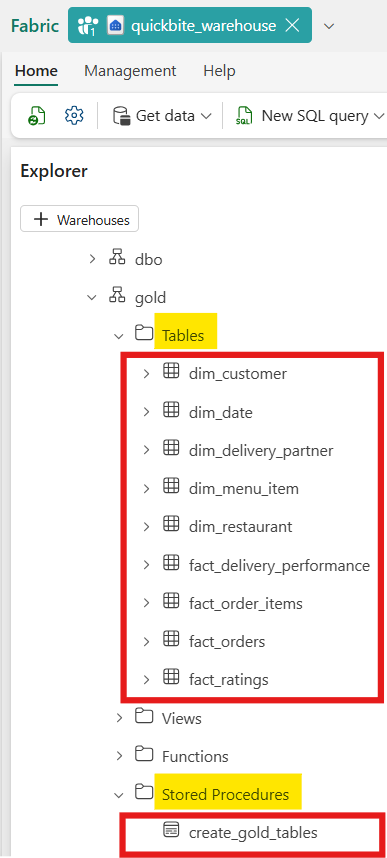

# ✅Creating Gold Tables Using Lakehouse Shortcuts

To build the **Gold layer** in a scalable and enterprise-ready way, we start by leveraging **Lakehouse shortcuts** instead of copying data across layers.

### Step 1: Create a Dedicated Shortcut Lakehouse

Create a new Lakehouse named **`quickbite_lakehouse_shortcut`** .
This Lakehouse will act as a **logical access layer** between Silver and the Warehouse.

Inside this Lakehouse:

- Go to **Tables → dbo**
- Click the **three dots → New table shortcut**
- Choose **Microsoft OneLake**
- Select the source Lakehouse: **`quickbite_lakehouse`**
- Select only the **`silver.*` tables**
- Create shortcuts for all required Silver tables

### Why Use Shortcuts?

Shortcuts are the **preferred approach** because:

- ✅ **No data is copied** (zero duplication)
- ✅ All layers read from a **central, governed Silver lake**
- ✅ Updates in Silver are instantly reflected downstream
- ✅ Storage cost and data drift are eliminated

This ensures the Silver layer remains the **single source of truth** .

### Step 2: Expose Silver Data to the Warehouse

Now navigate to the Warehouse **`quickbite_warehouse`** .

- Click **+ Warehouse**
- Select the **Lakehouse shortcut** (`quickbite_lakehouse_shortcut`)
- This makes all `silver.*` tables available in the Warehouse as queryable objects

At this point, the Warehouse can directly query Silver data **without ingestion or duplication** .

With Silver tables now accessible inside the Warehouse, we can:

- Write **T-SQL transformations**
- Create **Gold dimension and fact tables**
- Optimize for analytics, reporting, and BI consumption

The next sections will focus on **step-by-step creation of Gold tables** using T-SQL, following proper dimensional modeling and analytics best practices.

---

# ✅ Stored Procedure: Create Gold Tables from Silver (Fabric Warehouse)

You can paste this directly into:

<pre class="overflow-visible! px-0!" data-start="332" data-end="394"><div class="contain-inline-size rounded-2xl corner-superellipse/1.1 relative bg-token-sidebar-surface-primary"><div class="@w-xl/main:top-9 sticky top-[calc(--spacing(9)+var(--header-height))]"><div class="absolute end-0 bottom-0 flex h-9 items-center pe-2"><div class="bg-token-bg-elevated-secondary text-token-text-secondary flex items-center gap-4 rounded-sm px-2 font-sans text-xs"></div></div></div><div class="overflow-y-auto p-4" dir="ltr"><code class="whitespace-pre!"><span><span>Fabric Workspace → quickbite_warehouse → </span><span>New</span><span></span><span>SQL</span><span> Query</span></span></code></div></div></pre>

```sql
CREATE OR ALTER PROCEDURE gold.create_gold_tables
AS
BEGIN
    /*
        PURPOSE:
        --------
        This procedure creates all GOLD-layer tables in the Fabric Warehouse
        from SILVER tables stored in the Lakehouse via OneLake shortcuts.

        DESIGN PRINCIPLES:
        ------------------
        - Enterprise sequencing (Dimensions → Date → Facts)
        - CTAS pattern (CREATE TABLE AS SELECT)
        - Fabric-compatible data types only
        - No business logic duplication (Silver is source of truth)
        - Safe for orchestration via Fabric Pipelines

        EXECUTION OPTIONS:
        ------------------
        Option 1: Execute directly via SQL
                  EXEC gold.create_gold_tables;

        Option 2: Call this procedure from a Fabric Pipeline
                  using a "Warehouse SQL activity" for orchestration
    */

    /* ==============================
       STEP 1 — GOLD DIMENSIONS
       ============================== */

    -- dim_customer | Grain: 1 row per customer
    DROP TABLE IF EXISTS gold.dim_customer;
    CREATE TABLE gold.dim_customer AS
    SELECT
        customer_id,
        signup_date,
        city,
        acquisition_channel
    FROM quickbite_lakehouse_shortcut.dbo.[silver.dim_customer];


    -- dim_restaurant | Grain: 1 row per restaurant
    DROP TABLE IF EXISTS gold.dim_restaurant;
    CREATE TABLE gold.dim_restaurant AS
    SELECT
        restaurant_id,
        restaurant_name,
        city,
        cuisine_type,
        partner_type,
        avg_prep_time_min,
        is_active
    FROM quickbite_lakehouse_shortcut.dbo.[silver.dim_restaurant];


    -- dim_delivery_partner | Grain: 1 row per delivery partner
    DROP TABLE IF EXISTS gold.dim_delivery_partner;
    CREATE TABLE gold.dim_delivery_partner AS
    SELECT
        delivery_partner_id,
        partner_name,
        city,
        vehicle_type,
        employment_type,
        avg_rating,
        is_active
    FROM quickbite_lakehouse_shortcut.dbo.[silver.dim_delivery_partner];


    -- dim_menu_item | Grain: 1 row per menu item
    DROP TABLE IF EXISTS gold.dim_menu_item;
    CREATE TABLE gold.dim_menu_item AS
    SELECT
        menu_item_id,
        restaurant_id,
        item_name,
        category,
        is_veg,
        price
    FROM quickbite_lakehouse_shortcut.dbo.[silver.dim_menu_item];


    /* ==============================
       STEP 2 — GOLD DATE DIMENSION
       ============================== */

    -- dim_date | Grain: 1 row per calendar date
    DROP TABLE IF EXISTS gold.dim_date;
    CREATE TABLE gold.dim_date AS
    SELECT DISTINCT
        CAST(
            DATEFROMPARTS(
                YEAR(order_timestamp),
                MONTH(order_timestamp),
                DAY(order_timestamp)
            ) AS date
        )                                   AS date_key,

        YEAR(order_timestamp)               AS year,
        MONTH(order_timestamp)              AS month_number,

        CAST(DATENAME(MONTH, order_timestamp) AS varchar(15))
                                            AS month_name,

        CAST(LEFT(DATENAME(MONTH, order_timestamp), 3) AS varchar(3))
                                            AS month_name_short,

        DAY(order_timestamp)                AS day,

        DATEPART(WEEKDAY, order_timestamp)  AS day_of_week,

        CAST(DATENAME(WEEKDAY, order_timestamp) AS varchar(15))
                                            AS day_name,

        DATEPART(WEEK, order_timestamp)     AS week_of_year,

        CAST(
            CASE
                WHEN DATEPART(WEEKDAY, order_timestamp) IN (1,7)
                THEN 'Weekend'
                ELSE 'Weekday'
            END AS varchar(10)
        )                                   AS weekday_or_weekend,

        CAST(
            CASE
                WHEN MONTH(order_timestamp) BETWEEN 6 AND 9
                THEN 'Monsoon'
                ELSE 'Non-Monsoon'
            END AS varchar(15)
        )                                   AS monsoon_or_nonmonsoon

    FROM quickbite_lakehouse_shortcut.dbo.[silver.fact_orders];


    /* ==============================
       STEP 3 — GOLD FACT TABLES
       ============================== */

    -- fact_orders | Grain: 1 row per order
    DROP TABLE IF EXISTS gold.fact_orders;
    CREATE TABLE gold.fact_orders AS
    SELECT
        order_id,
        customer_id,
        restaurant_id,
        delivery_partner_id,
        order_timestamp,

        CAST(
            DATEFROMPARTS(
                YEAR(order_timestamp),
                MONTH(order_timestamp),
                DAY(order_timestamp)
            ) AS date
        )                                   AS order_date,

        subtotal_amount,
        discount_amount,
        delivery_fee,
        total_amount,
        is_cod,
        is_cancelled
    FROM quickbite_lakehouse_shortcut.dbo.[silver.fact_orders];


    -- fact_order_items | Grain: 1 row per order item
    DROP TABLE IF EXISTS gold.fact_order_items;
    CREATE TABLE gold.fact_order_items AS
    SELECT
        order_id,
        item_id,
        menu_item_id,
        restaurant_id,
        quantity,
        unit_price,
        item_discount,
        line_total
    FROM quickbite_lakehouse_shortcut.dbo.[silver.fact_order_items];


    -- fact_delivery_performance | Grain: 1 row per order
    DROP TABLE IF EXISTS gold.fact_delivery_performance;
    CREATE TABLE gold.fact_delivery_performance AS
    SELECT
        order_id,
        actual_delivery_time_mins,
        expected_delivery_time_mins,
        distance_km
    FROM quickbite_lakehouse_shortcut.dbo.[silver.fact_delivery_performance];


    -- fact_ratings | Grain: 1 row per order review
    DROP TABLE IF EXISTS gold.fact_ratings;
    CREATE TABLE gold.fact_ratings AS
    SELECT
        order_id,
        customer_id,
        restaurant_id,
        rating,
        review_text,
        review_timestamp,
        sentiment_score
    FROM quickbite_lakehouse_shortcut.dbo.[silver.fact_ratings];

END;
GO
```

## ▶️ How to Run

```sql
EXEC gold.create_gold_tables;
```



## 🧠

> “**_Silver tables remain centralized in the Lakehouse.
> Gold tables are materialized in the Warehouse using a stored procedure, which can be orchestrated via Fabric Pipelines.
> This avoids data duplication, enforces governance, and keeps analytics performant._**”

---
