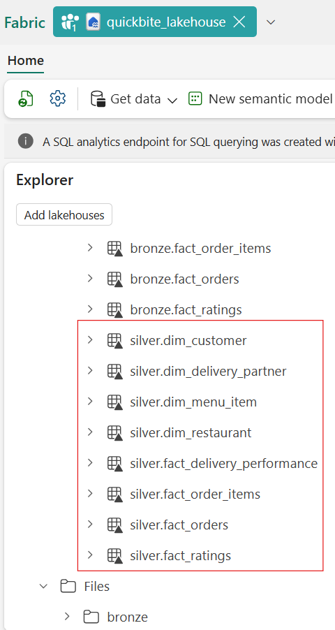

# 🥈 QuickBite Lakehouse — Silver Layer Documentation

**Phase 2: Data Cleaning & Conformed Schema**

---

## 📌 Overview

The **Silver Layer** represents the **cleaned and conformed data zone** in the QuickBite Lakehouse architecture.

At this stage, raw Bronze tables are transformed into **analytics-ready datasets** by:

- Standardizing formats and values
- Enforcing data quality rules
- Applying light derivations
- Ensuring consistency across facts and dimensions

No aggregations or business KPIs are created in Silver.
Silver acts as the **single trusted source** for downstream Gold modeling.

## 🎯 Objectives

- Convert raw Bronze tables into clean Silver tables
- Enforce consistent schemas and data types
- Standardize categorical fields
- Validate key uniqueness
- Prepare data for star-schema modeling in Gold

---

## 🧰 Components Used

### Primary Tool — Dataflows Gen2

Dataflows Gen2 is used to perform all Silver-layer transformations.

**Why Dataflows Gen2:**

- No-code / low-code transformation layer
- Ideal for conformed dimensions and cleaned fact tables
- Native integration with Fabric Lakehouse
- Supports validation, scheduling, and versioning
- Aligns with Microsoft Fabric best practices

> ⚠️ Notebooks (Spark/PySpark) are intentionally **not used** here, as transformations are deterministic and schema-focused.

---

## 🧱 Silver Table Design Principles

- One Silver table per Bronze source
- No joins across tables at this layer
- No aggregations or metrics
- Deterministic, repeatable transformations only
- Naming convention: `silver.<table_name>`

### Steps:

1. Go to `New Item` in Fabric Workspace.
2. Select **`Dataflows Gen2`** and name it **`Bronze_to_Silver`** .
3. Choose **Lakehouse** as the data source.
4. Connect to **quickbite_lakehouse → Tables (Bronze)** .
5. Load raw Bronze tables into Power Query (Dataflows editor).

---

## 📊 Fact Tables — Silver Transformations (Processed First)

### 1️⃣ silver.fact_orders

**Source:** `bronze.fact_orders`

**Transformation Objectives:**

- Ensure correct data types for timestamps and numeric fields
- Normalize boolean indicators (e.g., cancellation flags, COD flags)
- Validate uniqueness of `order_id`
- Preserve one-row-per-order granularity

**Outcome:**
Clean, query-ready order-level dataset suitable for trend analysis and joins.

### 2️⃣ silver.fact_order_items

**Source:** `bronze.fact_order_items`

**Transformation Objectives:**

- Validate numeric consistency for quantity and pricing fields
- Ensure correct typing for monetary values
- Validate uniqueness of `order_id` at item granularity
- Preserve one-row-per-order-item structure

**Outcome:**
Reliable order-line–level dataset for revenue and item-level analysis.

### 3️⃣ silver.fact_delivery_performance

**Source:** `bronze.fact_delivery_performance`

**Transformation Objectives:**

- Ensure numeric consistency for delivery times and distances
- Validate uniqueness of `order_id`
- Preserve SLA-related metrics without aggregation

**Outcome:**
Clean delivery performance dataset for SLA and operational analysis.

### 4️⃣ silver.fact_ratings

**Source:** `bronze.fact_ratings`

**Transformation Objectives:**

- Standardize review text formatting
- Ensure rating values are numeric and within valid range
- Parse review timestamps into proper datetime format
- Preserve one-row-per-order-review structure

**Outcome:**
Clean feedback dataset ready for sentiment and trust analysis.

---

## 🧩 Dimension Tables — Silver Transformations (Processed After Facts)

### 5️⃣ silver.dim_customer

**Source:** `bronze.dim_customer`

**Transformation Objectives:**

- Parse and standardize signup dates
- Normalize city and acquisition channel values
- Remove leading/trailing whitespace
- Enforce uniqueness of `customer_id`

**Outcome:**
Conformed customer dimension for segmentation and cohort analysis.

### 6️⃣ silver.dim_restaurant

**Source:** `bronze.dim_restaurant`

**Transformation Objectives:**

- Standardize restaurant names, city, cuisine type, and partner type
- Normalize active/inactive indicators
- Enforce uniqueness of `restaurant_id`

**Outcome:**
Clean restaurant dimension suitable for partner performance modeling.

### 7️⃣ silver.dim_delivery_partner

**Source:** `bronze.dim_delivery_partner`

**Transformation Objectives:**

- Normalize partner name, city, vehicle type, and employment type
- Standardize active status indicators
- Enforce uniqueness of `delivery_partner_id`

**Outcome:**
Conformed delivery partner dimension for operational analysis.

### 8️⃣ silver.dim_menu_item

**Source:** `bronze.dim_menu_item`

**Transformation Objectives:**

- Standardize item names and categories
- Normalize vegetarian/non-vegetarian indicators
- Enforce uniqueness of `menu_item_id`

**Outcome:**
Clean menu item dimension for item-level and cuisine analysis.

---

## 💾 Saving & Publishing Strategy

- Each table is handled as a **separate query** in Dataflows Gen2
- Output destination:
  ```
  quickbite_lakehouse → Tables → silver.<table_name>
  ```
- Dataflows are validated before execution



---

## ✅ Silver Layer Best Practices Followed

- ✔ Cleaned but **not aggregated**
- ✔ No business KPIs or metrics
- ✔ Deterministic and repeatable transformations
- ✔ Consistent naming and schema enforcement
- ✔ Ready for Gold star-schema modeling

---

## 🔜 Next Phase

➡️ **Gold Layer**

- Business logic and aggregations
- Star schema modeling
- KPIs for crisis recovery analysis
- Warehouse-based analytical tables

---

**Layer:** Silver
**Platform:** Microsoft Fabric (Lakehouse + Dataflows Gen2)

---
